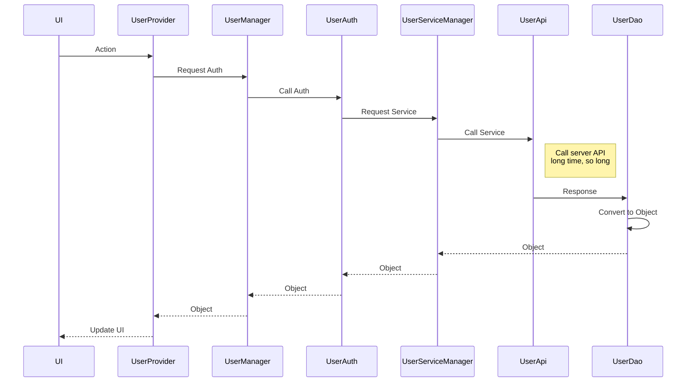

# Flutter Project Structure Template

## Basic Template
in main.dart

AppBar ,
Drawer ,
BottomAppBar ,

## Example : User Auth Diagram

Example of the step of calling a User Authentication.

<b>UI</b> : Page or Widgets
<b>UserProvider</b> : Classes that manage the states of widgets.
<b>UserManager</b> : Classes that collect services about users.
<b>UserAuth</b> : Classes that prepare and serve all data about user authentication. 
<b>UserServiceManager</b> : Classes that managing about service of user. 
<b>UserApi</b> : Classes that define all method of api using.
<b>UserDao</b> : Class that compatible with response.

### UI 
Widget

Flow chart:

